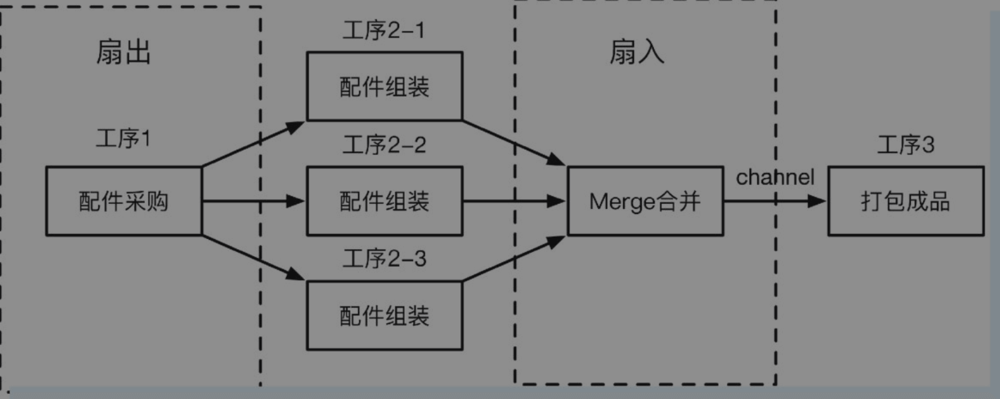

.. _go_concurrency_patterns:

Go 并发设计模式
=====================================================================

屏障模式(Barrier Mode)
--------------------------------------------------
屏障模式(Barrier Mode)，用来阻塞goroutine直到聚合所有goroutine返回结果，可以用通道实现。使用场景：

1. 多个网络请求并发，聚合结果
2. 粗粒度任务拆分并发执行，聚合结果

.. code-block:: go

    package main

    import (
        "fmt"
        "io/ioutil"
        "net/http"
        "time"
    )

    // 封装屏障模式响应的结构体(一般就是返回值和错误)
    type BarrierResponse struct {
        Err    error
        Resp   string
        Status int
    }

    // 执行单个请求，结果放入 channel
    func doRequest(out chan<- BarrierResponse, url string) {
        res := BarrierResponse{}
        client := http.Client{Timeout: time.Duration(3 * time.Second)}
        resp, err := client.Get(url)
        if resp != nil {
            res.Status = resp.StatusCode
        }
        if err != nil {
            res.Err = err
            out <- res
            return
        }

        b, err := ioutil.ReadAll(resp.Body)
        defer resp.Body.Close()
        if err != nil {
            res.Err = err
            out <- res
            return
        }
        res.Resp = string(b)
        out <- res //  结果放入通道
    }

    // 并发请求并聚合结果
    func Barrier(urls ...string) {
        n := len(urls)
        in := make(chan BarrierResponse, n)
        response := make([]BarrierResponse, n)
        defer close(in)

        for _, url := range urls {
            go doRequest(in, url)
        }

        var hasError bool
        for i := 0; i < n; i++ {
            resp := <-in
            if resp.Err != nil {
                fmt.Println("Error: ", resp.Err, resp.Status)
                hasError = true
            }
            response[i] = resp
        }
        if !hasError {
            for _, resp := range response {
                fmt.Println(resp.Status)
            }
        }
    }

    func main() {
        urls := []string{
            "https://www.baidu.com",
            "https://www.weibo.com",
            "https://www.zhihu.com",
        }
        Barrier(urls...)
    }

未来模式(Future Mode)
--------------------------------------------------
Future模式(也称为Promise Mode)。使用 `fire-and-forget` 方式，主进程不等子进程执行完就直接返回，然后等到未来执行完的时候再去获取结果。
未来模式中主goroutine不用等待子goroutine返回的结果，可以先去做其他事情，等未来需要子goroutine结果的时候再来取。
如果子goroutine还没有返回结果，则一直等待。以下简单的代码示例说明了该模式的原理：

.. code-block:: go

    c := make(chan int)      // future
    go func() { c <- f() }() // async
    value := <-c             // await

可以针对 future 模式做一个统一的封装，方便后续使用，代码示例如下：

.. code-block:: go

    /* https://github.com/golang-collections/go-datastructures/blob/59788d5eb259/futures/futures.go
    Package futures is useful for broadcasting an identical message to a multitude
    of listeners as opposed to channels which will choose a listener at random
    if multiple listeners are listening to the same channel.  The future will
    also cache the result so any future interest will be immediately returned
    to the consumer.
    */
    package main

    import (
        "fmt"
        "sync"
        "time"
    )

    // Completer is a channel that the future expects to receive
    // a result on.  The future only receives on this channel.
    type Completer <-chan interface{}

    // Future represents an object that can be used to perform asynchronous
    // tasks.  The constructor of the future will complete it, and listeners
    // will block on getresult until a result is received.  This is different
    // from a channel in that the future is only completed once, and anyone
    // listening on the future will get the result, regardless of the number
    // of listeners.
    type Future struct {
        triggered bool // because item can technically be nil and still be valid
        item      interface{}
        err       error
        lock      sync.Mutex
        wg        sync.WaitGroup
    }

    // GetResult will immediately fetch the result if it exists
    // or wait on the result until it is ready.
    func (f *Future) GetResult() (interface{}, error) {
        f.lock.Lock()
        if f.triggered {
            f.lock.Unlock()
            return f.item, f.err
        }
        f.lock.Unlock()

        f.wg.Wait()
        return f.item, f.err
    }

    func (f *Future) setItem(item interface{}, err error) {
        f.lock.Lock()
        f.triggered = true
        f.item = item
        f.err = err
        f.lock.Unlock()
        f.wg.Done()
    }

    func listenForResult(f *Future, ch Completer, timeout time.Duration, wg *sync.WaitGroup) {
        wg.Done()
        select {
        case item := <-ch:
            f.setItem(item, nil)
        case <-time.After(timeout):
            f.setItem(nil, fmt.Errorf(`Timeout after %f seconds.`, timeout.Seconds()))
        }
    }

    // New is the constructor to generate a new future.  Pass the completed
    // item to the toComplete channel and any listeners will get
    // notified.  If timeout is hit before toComplete is called,
    // any listeners will get passed an error.
    func New(completer Completer, timeout time.Duration) *Future {
        f := &Future{}
        f.wg.Add(1)
        var wg sync.WaitGroup
        wg.Add(1)
        go listenForResult(f, completer, timeout, &wg)
        wg.Wait()
        return f
    }

    // 使用示例
    func main() {
        c := make(chan interface{})

        go func() {
            time.Sleep(time.Second)
            c <- "hehe"
        }()

        f := New(c, time.Second*3)
        res, err := f.GetResult()
        fmt.Println(res, err)
    }

管道模式(Pipeline Mode)
--------------------------------------------------
也称作流水线模式，一般有以下几个步骤：

1. 流水线由一道道工序构成，每道工序通过通道把数据传递到下一个工序
2. 每道工序一般会对应一个函数，函数里有协程和通道，协程一般用于处理数据并把它放入通道中，每道工序会返回这个通道以供下一道工序使用
3. 最终要有一个组织者（示例中的main()函数）把这些工序串起来，这样就形成了一个完整的流水线，对于数据来说就是数据流

.. code-block:: go

    // 以组装计算机为例。三道工序：配件采购(Buy)-> 配件组装(Build) -> 打包成品(Pack)
    func Buy(n int) <-chan string {
        out := make(chan string)
        go func() {
            defer close(out)
            for i := 1; i <= n; i++ {
                out <- fmt.Sprintf("配件%d", i)
            }
        }()
        return out
    }

    func Build(in <-chan string) <-chan string {
        out := make(chan string)
        go func() {
            defer close(out)
            for c := range in {
                out <- fmt.Sprintf("组装(%s)", c)
            }
        }()
        return out
    }

    func Pack(in <-chan string) <-chan string {
        out := make(chan string)
        go func() {
            defer close(out)
            for c := range in {
                out <- fmt.Sprintf("打包(%s)", c)
            }
        }()
        return out
    }

    func main() {
        accessories := Buy(6)
        computers := Build(accessories)
        packs := Pack(computers)
        for p := range packs {
            fmt.Println(p)
        }
    }

.. code-block:: go

    package main

    import "fmt"

    // 工序 1：数组生成器
    func Generator(max int) <-chan int {
        out := make(chan int, 100)
        go func() {
            for i := 1; i <= max; i++ {
                out <- i
            }
            close(out)
        }()
        return out
    }

    // 工序 2：求整数的平方
    func Square(in <-chan int) <-chan int {
        out := make(chan int, 100)
        go func() {
            for v := range in {
                out <- v * v
            }
            close(out)
        }()
        return out
    }

    // 工序 3：求和
    func Sum(in <-chan int) <-chan int {
        out := make(chan int, 100)
        go func() {
            var sum int
            for v := range in {
                sum += v
            }
            out <- sum
            close(out)
        }()
        return out
    }

    func main() {
        arr := Generator(5)
        squ := Square(arr)
        sum := <-Sum(squ)
        fmt.Println(sum)
    }

扇出和扇入模式(Fan-out Fan-in)
--------------------------------------------------
扇出(Fan-out)是指多个函数可以从同一个通道读取数据，直到该通道关闭。扇入(Fan-in)是指一个函数可以从多个输入中读取数据并继续进行，
直到所有输入都关闭。扇出和扇入模式的方法是将输入通道多路复用到一个通道上，当所有输入都关闭时，该通道才关闭。
扇出的数据流向是发散传递出去，是输出流；扇入的数据流向是汇聚进来，是输入流。

.. code-block:: go

    // 扇入函数，把多个channel 中的数据发送到一个 channel 中
    func Merge(ins ...<-chan string) <-chan string {
        var wg sync.WaitGroup
        out := make(chan string)

        p := func(in <-chan string) {
            defer wg.Done()
            for c := range in {
                out <- c
            }
        }

        wg.Add(len(ins))
        // 扇入
        for _, cs := range ins {
            go p(cs)
        }
        go func() {
            wg.Wait()
            close(out)
        }()
        return out
    }

    func main() {
        accessories := Buy(12)
        computers1 := Build(accessories)
        computers2 := Build(accessories)
        computers3 := Build(accessories)
        computers := Merge(computers1, computers2, computers3)
        packs := Pack(computers)
        for p := range packs {
            fmt.Println(p)
        }
    }

协程池模式
--------------------------------------------------
即便 go 的协程比较轻量，但是当需要操作大量 goroutine 的时候，依然有内存开销和 GC 的压力。可以考虑使用协程池减少频繁创建销毁协程的开销。

.. code-block:: go

    package main

    import (
        "fmt"
        "sync"
        "sync/atomic"
    )

    // 任务处理器
    type TaskHandler func(interface{})

    // 任务结构体
    type Task struct {
        Param   interface{}
        Handler TaskHandler
    }

    // 协程池接口
    type WorkerPoolImpl interface {
        AddWorker()
        SendTask(Task)
        Release()
    }

    // 协程池
    type WorkerPool struct {
        wg   sync.WaitGroup
        inCh chan Task
    }

    func (d *WorkerPool) AddWorker() {
        d.wg.Add(1)
        go func() {
            defer d.wg.Done()
            for task := range d.inCh {
                task.Handler(task.Param)
            }
        }()
    }

    func (d *WorkerPool) Release() {
        close(d.inCh)
        d.wg.Wait()
    }

    func (d *WorkerPool) SendTask(t Task) {
        d.inCh <- t
    }

    func NewWorkerPool(buffer int) WorkerPoolImpl {
        return &WorkerPool{
            inCh: make(chan Task, buffer),
        }
    }

    func main() {
        bufferSize := 100
        var workerPool = NewWorkerPool(bufferSize)
        workers := 4
        for i := 0; i < workers; i++ {
            workerPool.AddWorker()
        }

        var sum int32
        testFunc := func(i interface{}) {
            n := i.(int32)
            atomic.AddInt32(&sum, n)
        }

        var i, n int32
        n = 100
        for ; i < n; i++ {
            task := Task{
                i,
                testFunc,
            }
            workerPool.SendTask(task)
        }
        workerPool.Release()
        fmt.Println(sum) // 4950
    }

参考：《Go 语言高级开发与实战》
