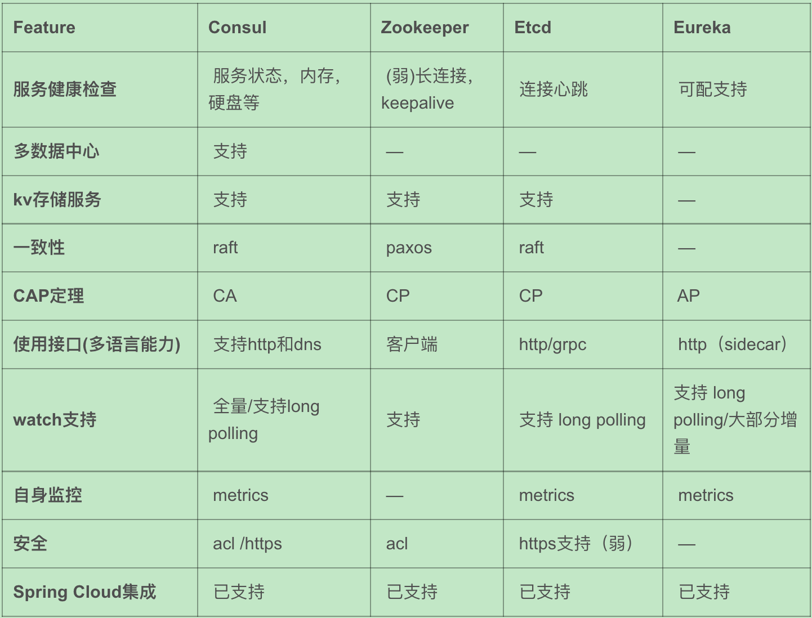

.. _library:

=========================================
云原生时代-微服务/分布式系统组件
=========================================

介绍一些微服务中的常见问题，包括常见概念，中间件，开源系统等，佛系更新中。

限流器
----------------------

某些业务需要针对 IP 或者用户来进行一个限流操作，减少恶意请求，减轻服务器压力或者根据业务需求来进行频率控制。
限流可以在很多层面去做，比如 nginx+lua, API Gateway，或者在接口层直接来做，一般可以结合 redis 来做为计数器。
解决高并发问题有一下一些实现方式，可以根据业务场景选择：

- 扩容
- 静态化(cdn)
- 限流
- 缓存
- 队列(削峰，解耦)

常见的几种限流算法有计数器算法、漏桶算法、令牌桶算法。

- token bucket。令牌桶算法。允许突发流量。https://github.com/juju/ratelimit 或者 go 自带的 https://github.com/golang/time
- leaky bucket。漏桶算法。以恒定速率处理(恒定速率漏水) https://github.com/uber-go/ratelimit
- redis incr/expire。最简单的一种方式，通过 redis 针对用户或者 ip key 来计数，可以加上用户信息作为 key
- redis zset。可以实现基于时间窗口来限流。不过不适合短期内大量 qps 限流，适合用户行为限流

你可以在网上很方便的搜索 『rate limiter』 来找到对应的实现。

- `分布式系统高可用实战之限流器（Go 版本实现） <https://juejin.im/post/5eb2cfcce51d4528dd23bd7e>`_
- `5种常见限流算法 <https://juejin.cn/post/6915591543797596174#heading-6>`_

断路器/熔断器(Circuit Breaker)
-------------------------------------------

在分布式系统中，为了防止级联错误，导致服务雪崩，经常需要使用断路器来保护系统。断路器原理如下：

.. image:: ../_image/microservice_distribute/熔断器原理.png

Netflix 开源的 Hystrix 是比较流行的开源实现，对应的有各种其他语言的实现，比如 Hystrix-go

参考:

- `Circuit Breaker and Retry  <https://medium.com/@trongdan_tran/circuit-breaker-and-retry-64830e71d0f6>`_

分布式 id 生成器(发号器)
-------------------------------
单机 mysql 一般我们直接使用 mysql 提供的自增 id 作为主键，但是分布式系统下需要别的算法来保证多机 mysql 全局自增唯一 id。
一般有如下一些实现方式，各有优劣，可以根据自己的业务灵活选取：

- 发号器(snowflake 算法)
- uuid

一般来说单调递增整形 id 对于索引更加友好，所以一般我们可以使用 snowflake 之类的算法来分配 id，其大致原理如下：

.. image:: ../_image/microservice_distribute/slowflake.png

网上依旧很多开源实现，你可以搜索到一些 snowflake 的 golang 实现，注意依赖时间戳有些可能有时钟回拨问题。

- `bwmarrin/snowflake <https://github.com/bwmarrin/snowflake>`_
- `9种分布式ID生成方式 <https://zhuanlan.zhihu.com/p/107939861>`_

RPC
----------------------
在分布式系统中，不同业务模块之间可以通过消息队列或者 rpc 来进行通信。

服务注册与发现
----------------------

- 注册: 服务启动的时候通过某种形式比如 http 请求、消息等将自己的信息通知到服务注册中心(zookeeper/consul等)
- 维护: 健康检查、异常剔除
- 发现: 服务名称获取 ip 等信息。高可用（本机文件缓存）；高性能（内存缓存）；负载均衡(优先级)

常用组件(倾向于 AP 模型优先保证可用性)：

- Consul
- Etcd
- Zookeeper: CP 模型
- Eureka: AP 模型

微服务网关
----------------------
入口网关的功能：

- 协议转换。为客户端提供统一的接入地址和协议，屏蔽掉后端服务不同的协议细节
- 植入服务熔断、服务降级、流量控制、分流控制等服务治理相关的策略
- 认证和授权。统一处理不同端的认证和授权，为后端服务屏蔽掉认证细节
- 黑白名单限制

常见组件：

- Nginx
- Netflix Zuul
- Kong

配置中心
----------------------
- Apollo: https://github.com/ctripcorp/apollo
- Spring Cloud Config
- Disconf

健康检查
----------------------

日志聚合(ELK)
----------------------

分布式跟踪(tracing)
----------------------

异常跟踪
----------------------
分布式系统中，和追踪日志一样也会遇到集中收集程序异常的问题。这里推荐笔者公司常用的一个系统叫做 sentry。它可以收集
和展示比如 Python 的异常或者 golang 的 error并收集上下文，方便我们快速排查程序中的严重问题。

应用程序指标
----------------------

分布式锁
----------------------
单机上可以使用 go 提供的 sync 包加锁，分布式情况下一般有几种方式：

- redis: 借助 setnx。性能较高
- Redlock算法: https://github.com/go-redsync/redsync
- zookpeer: 适合分布式调度，不适合高频率持有时间短的抢锁场景
- etcd

参考:

- `彻底理解分布式锁原理并附上常用的分布式锁实现 <asdf https://zhuanlan.zhihu.com/p/413567720>`_

消息队列
----------------------
消息队列在分布式系统中一般用在异步解耦、削峰填谷等场景。消息队列的核心模型由生产者消费者和消息中间件(Broker)组成。
常用的开源解决方案有ActiveMQ、RabbitMQ、Kafka、RocketMQ和近年比较火的Pulsar。
但是消息会有延迟、乱序、丢失等问题，需要根据业务做好设计和取舍。

场景：系统崩溃；服务处理能力受限；链路耗时长尾请求；日志处理

延时队列(延迟队列)
----------------------
在分布式系统中经常需要触发一些延后执行的任务，比如用户下单超过30 分钟未支付取消订单、定时给预定会议的人员发送消息、外卖下单后提醒小哥即将超时，
这个时候一般会使用到延时队列。延时队列很像是一种以时间为权重的堆结构。常见的实现方式是使用 redis zset/死信队列/时间轮/多层时间轮等。
从调研结果来看，很多方案和框架都是使用的基于 redis 实现。

- 定时轮询数据库。只适合非常小规模的业务比如一些公司内部系统，拿出所有任务扫一遍执行到期任务。
- redis zset/redis过期回调。把topic作为key，时间作为score加入到 zset，定时器通过 ZREANGEBYSCORE 查询 zset 中 score 最小的元素拿出来执行。(防止大 key 一般可能分散多个zset)
- RabbitMQ: 依赖 TTL 和死信队列实现延迟队列效果。(需要有熟悉的运维支持)
- RocketMQ 支持延时消息。消息延迟级别分别为1s 5s 10s 30s 1m 2m 3m 4m 5m 6m 7m 8m 9m 10m 20m 30m 1h 2h，共18个级别。
- kafka: 用 kafka topic 模拟死信队列（不过不太优雅）
- 时间轮/多级时间轮: 在 kafka/netty 内部实现中有用到

有一些语言框架直接帮我们实现好了，也可以直接拿来用，一般需要一个消息队列作为broker。现有方案：

- celery: python 社区常用的异步任务框架，支持定时、延时任务
- machinery: golang 社区的 celery，支持延时任务
- LMSTFY: 美图开源的基于 go和redis 实现的任务队列
- asynq: https://github.com/hibiken/asynq 基于go redis的简单高效的任务队列

参考：

- `你真的知道怎么实现一个延迟队列吗 <https://zhuanlan.zhihu.com/p/266156267>`_
- https://juejin.cn/post/7052894117105238053 延时消息常见实现方案

分布式缓存
----------------------

常见缓存使用模式
----------------------

- Cache Aside: 如果数据在缓存中直接读取缓存；如果没有缓存 **应用从数据库读取** ；更新数据到缓存(下次直接可以从缓存读取了)
- Read Through: 如果数据在缓存中直接读取缓存；如果不存在 **缓存负责从数据库读取** ；缓存返回给应用。应用只和缓存交互
- Write Through: 应用写到缓存；缓存直接写到数据库
- Write Back (Write Behind): 应用直接写到缓存(缓存高可用)；缓存定期把更新刷新到数据库。Write behind 模式下适合大量写操作的场景，常用于电商秒杀场景中库存的扣减。
- Write-Around。对一致性的要求较弱，可以选择在 cache aside 读模式下增加一个缓存过期时间，在写请求中仅仅更新数据库，不做任何删除或更新缓存的操作，这样，缓存仅能通过过期时间失效

读多写少的场景下，可以选择采用“ Cache-Aside 结合消费数据库日志做补偿”的方案，写多的场景下，可以选择采用“ Write-Through 结合分布式锁”的方案 ，
写多的极端场景下，可以选择采用“ Write-Behind ” 的方案。

参考：

- https://bluzelle.com/blog/things-you-should-know-about-database-caching
- https://zhuanlan.zhihu.com/p/554879252 浅谈缓存最终一致性的解决方案

缓存问题（雪崩，击穿，穿透，回源，预热）
-------------------------------------------------
- 缓存和数据库双写一致性问题

- 缓存雪崩: 缓存同一时间全部失效导致数据库瞬间压力陡增引起雪崩。缓存宕机，设置相同过期时间可能导致。(热数据集中淘汰)

  - 做好熔断
  - 缓存时间加上超时随机，防止同时大量缓存失效
  - 加锁或者队列的方式保证不会同时对数据库进行读写

- 缓存击穿: 某个key缓存过期的那一刻，同时大量请求击穿打到数据库，瞬时数据库压力陡增。可以使用 singleflight 模式避免，原
  理就是当缓存失效的时候，相同 key 的请求只放行一个到后台数据库，减少请求压力。多线程获取应该用锁限制只有一个线程回源。

- 缓存穿透: 大量查询 key 不存在导致请求回源到数据库，导致数据库压力增大甚至宕机。(比如爬虫遍历抓取碰到大量不存在内容)

  - 业务层直接过滤不合理数据
  - 可以把所有可能存在的数据放到足够到的bitmap 或者布隆过滤器中，查询之前如果不在其中则过滤掉
  - 查询不到的值也放到缓存中加上较短的失效时间

- 缓存污染：爬虫批量抓取导致缓存了很多冷数据

- 缓存并发竞争: 串行化操作或者加锁

- 缓存预热。上线之前可以通过脚本来进行预热，定期刷新

- 热点key。热点 key 导致单机 redis 压力陡增，通过 key hash分散热点或者使用本地缓存的方式(多级缓存)，减小 redis 压力

- 大 key。string过大或者复合结构存的值过多，可能造成内存使用不均、网络阻塞、带宽占满。可以通过对 key 进行 hash 的方式分散到
  多个 key 存储。

- 回源。过期 key 会回源一般有两种方式，一种是被动更新，一种是主动更新。

  - 被动更新：缓存过期的时候回源到 db，注意防止击穿，使用 singleflight 模式或者分布式锁保证只有一个线程回源。
  - 主动更新：db 数据更新之后可以写入消息队列，消费者拉取信息更新本地缓存。

参考：

- https://help.aliyun.com/document_detail/353223.html

双写不一致性问题
----------------------

分布式事务
----------------------

超卖问题
----------------------
在关系数据库之外进行热卖商品的库存扣减操作。使用分布式锁会比较重。有以下两种方式：

- 基于乐观锁实现库存扣减。redis WATCH/MULTI/EXEC 命令结合即可实现乐观锁效果。
- 结合 lua 脚本实现库存扣减。 redis执行 EVAL/EVALSHA 把它当做单条命令在执行，操作原子。扣减成功后，可以写入到消息队列实现削峰，保证写入到数据库的流量可控。

分布式高并发系统保护措施
---------------------------
- 限流。限制资源数量上限，超过上限被缓冲或者失败。保护底层资源。常见有计数器、漏桶、令牌桶、滑动窗口等算法。
- 熔断。防止级联错误雪崩(底层旁路故障导致雪崩)。一般由调用端提供，用在不太重要的旁路请求上，避免因为不重要的服务异常或者超时影响重要的逻辑业务。
- 降级。一般考虑整体性从源头切断流量来源，比如暂停一些不重要服务，防止资源争夺。降级不重要服务，保证最核心服务的稳定
- 预热。一般是由于冷启动或者负载均衡重分配，缓存没有准备完成，可以提前预热。避免资源死锁或者被打挂
- 被压(Back Pressure): 智能化限流。被调用方通过反馈自己的处理能力，让调用方实时调整发送频率。典型的是 TCP 滑动窗口

容错策略：

- 故障转移(Failover): 自动切换其他副本(具备幂等性)
- 快速失败(Failfast): 非幂等，比如转账
- 安全失败(Failsafe): 旁路调用失败，也当成正确的来返回
- 沉默失败(Failsilent): 默认服务一段时间无法继续提供服务
- 故障恢复(Failback): 失败信息放入消息队列，自动异步重试(最大重试次数)。适合幂等性的对实时性要求不高的主路或者不需要返回
  值的旁路逻辑
- 并行调用(Forking): 双重保障，选择第一个返回成功的
- 广播调用(Broadcast): 要求所有请求都成功，比如“刷新分布式缓存”这类操作

容错设计模式：(熔断、隔离、重试、降级、超时)

- 断路器模式:hystrix/sentinel (快速失败)
- 舱壁隔离模式: 每个服务最大线程数限制 (静默失败)
- 重试模式(注意幂等性；重试风暴；超时设置)

  - 主路关键逻辑同步重试
  - 仅对瞬时故障重试。比如 http 状态码
  - 仅对幂等性服务重试
  - 重试必须有终止条件：超时终止；次数终止

流量统计指标：

- 每秒事务数(TPS): 衡量吞吐量最终标准。事务理解为一个逻辑上具备原子性的业务操作
- 每秒请求数(HPS): 客户端向服务端的请求数
- 每秒查询数(QPS): 一台服务器能够响应查询次数

限流设计模式：

- 流量计数器模式
- 滑动窗口限流 (否决式限流，超过阈值必须失败或者降级)
- 漏桶模式
- 令牌桶模式
- 自适应模式。根据机器的 cpu/io/内存利用率等超过阈值自动触发
- 单机与分布式

搜索引擎(Elasticsearch)
-------------------------------

业务边界划分(领域驱动设计)
-------------------------------
笔者感觉微服务的业务划分不光是一个技术问题，还是一个业务问题。笔者经历过的一些项目有时候感觉拆分太细，不像是微服务，反而
是微函数或者微接口了，维护和部署成本急剧升高。粒度太粗了可能又成了一个大的单体项目。
微服务有自己的优势，但也有缺点，比如需要较高的 devops 水平，良好的基础设施，合理的业务代码划分等，如果做不好可能微
服务带来的问题会比收益要多。所以微服务可能也不是银弹，需要根据当前的业务合理选择。

参考:
----------------------

- https://github.com/doocs/advanced-java
- 《微服架构设计模式》 一本比较好的讲微服务架构实现的书籍
- 《凤凰架构》
- https://github.com/theanalyst/awesome-distributed-systems
- https://github.com/ty4z2008/Qix/blob/master/ds.md#
